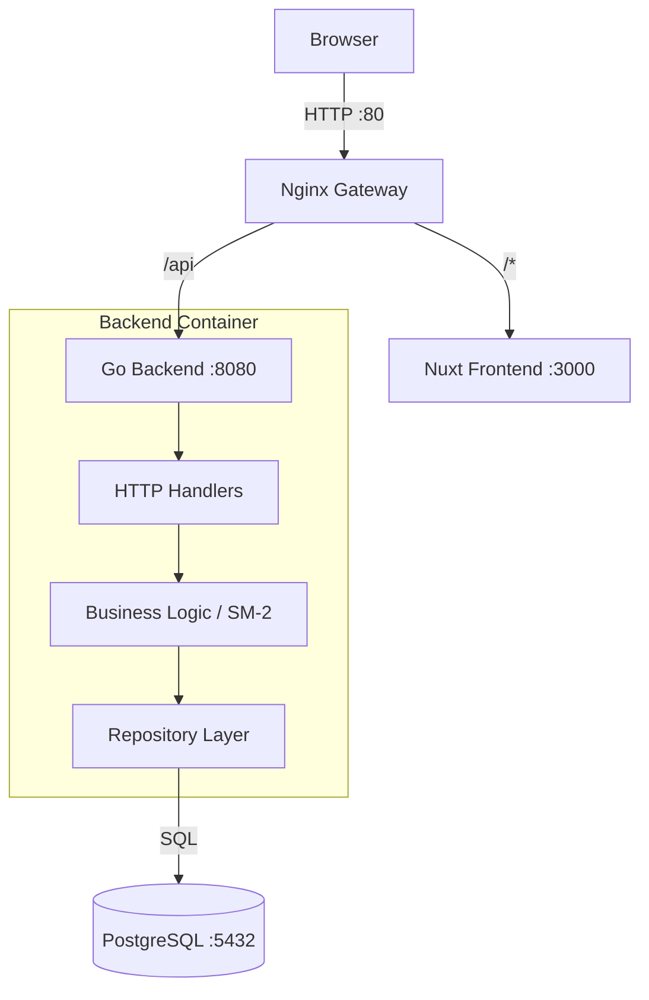

# 🧠 Flip - Spaced Repetition Flashcard App

**Flip** is a full-stack web application designed to help users learn and retain information efficiently using the **SuperMemo-2 (SM-2)** Spaced Repetition algorithm.

The app features a robust Go backend, a modern Nuxt frontend, and a fully containerized Docker environment.

---

## ✨ Features

- **🔐 Secure Authentication:** Login/Registration system with JWT cookies and Bcrypt password hashing.
- **🧠 Spaced Repetition (SM-2):** A smart algorithm that schedules reviews based on your performance.
- **📚 Deck Management:** Create, rename, and delete decks to organize your studies.
- **⚡ CSV Import:** Bulk import flashcards from CSV files.
- **📊 Statistics:** Visual breakdown of your learning progress (New, Learning, Mature) using Chart.js

---

## 🛠️ Tech Stack

| Layer | Technology | 
|------|------------|
| **Backend** | **Go 1.24** | 
| **Database** | **PostgreSQL** | 
| **Frontend** | **Nuxt 4** | 
| **State Management** | **Pinia** | 
| **Infra** | **Docker** |
| **Gateway** | **Nginx** | 

---

## 🏗️ Architecture

The project follows a **Layered Architecture** to separate concerns:


---

## 🚀 Getting Started

Follow these steps to get the app running on your machine.

### Prerequisites
*   [Docker Desktop](https://www.docker.com/products/docker-desktop/) 
*   Git

### 1. Clone the Repository
```bash
git clone https://github.com/FizzaSadath/flashcard-app.git
cd flashcard-app
```

### 2. Configure Environment
Create a `.env` file in the **root** directory (`flashcard-app/.env`). Paste the following configuration:

```ini
# Database Configuration
DB_HOST=db
DB_PORT=5432
DB_USER=flash_user
DB_PASSWORD=flash_password
DB_NAME=flashcard_db

# Security (Replace with a random string for production)
JWT_SECRET=super-secret-key-change-me
```

### 3. Build & Run
Run the following command to build images and start the containers.

```bash
docker compose up --build
```
*> **Note:** The first run may take a few minutes to download the Go and Node images.*

### 4. Access the App
Once the logs show the servers are running, open your browser:

*   **Frontend UI:** [http://localhost](http://localhost)
*   **Backend Health Check:** [http://localhost/api/ping](http://localhost/api/ping)

---

## 📖 Usage Guide

### Importing Cards via CSV
You can bulk upload cards to a deck. The CSV file must follow this exact format (headers are optional but recommended):

**`cards.csv`**
```csv
Front,Back
What is Go?,A compiled systems programming language.
"What is Docker?","A platform for developing, shipping, and running applications."
```
*   **Note:** If your text contains commas, wrap the text in double quotes `"`.

### Study Mode Grading
When reviewing a card, grade yourself honestly to optimize the algorithm:
*   **0-2 (Fail):** You forgot. The card interval resets.
*   **3 (Hard):** You remembered with significant effort.
*   **4 (Good):** You remembered comfortably.
*   **5 (Easy):** Instant recall. The interval increases aggressively.

---

### View Statistics
You can view your statistics by clicking stats on the navbar
*   Cards are classified as **new** (interval = 0), **learning** (interval > 0 & < 21) and **mature** (interval>21). 
*   You can view global count of new, learning and mature cards.
*   You can also view deck-wise breakdown of the three types of cards.

### View Streaks and Interval
*   You can view how the interval pushes far apart when your streak increases.
*   To view them, click on cards of a particular deck.


---

## 🧪 Running Tests

To run the backend integration tests (requires Go installed locally):

1.  Ensure the Docker database container is running.
2.  Navigate to the backend folder:
    ```bash
    cd backend
    ```
3.  Run the tests:
    ```bash
    go test -v ./internal/repo
    ```

---

## 🔧 Troubleshooting

**1. "Connection Refused" / Database errors**
*   Ensure you created the `.env` file in the **Root** folder, not inside `/backend`.
*   Ensure Docker Desktop is actually running.

**2. Port 80 is already in use**
*   If you have another server running (like Apache), open `docker-compose.yml` and change the Nginx ports to `"8080:80"`. Access the app at `http://localhost:8080`.
  
**3. Bind for 0.0.0.0:5432 failed: port is already allocated**
*   If you have already have postgres running on your computer, open `docker-compose.yml` and change the db ports to `"5433:5432"`(or another unused port if 5433 is also taken).
  
**4. "Changes not showing up"**
*   The frontend uses Hot Reloading (HMR), so changes appear instantly.
*   If you change Go code, you must restart the backend container: `docker compose restart backend`.

---


